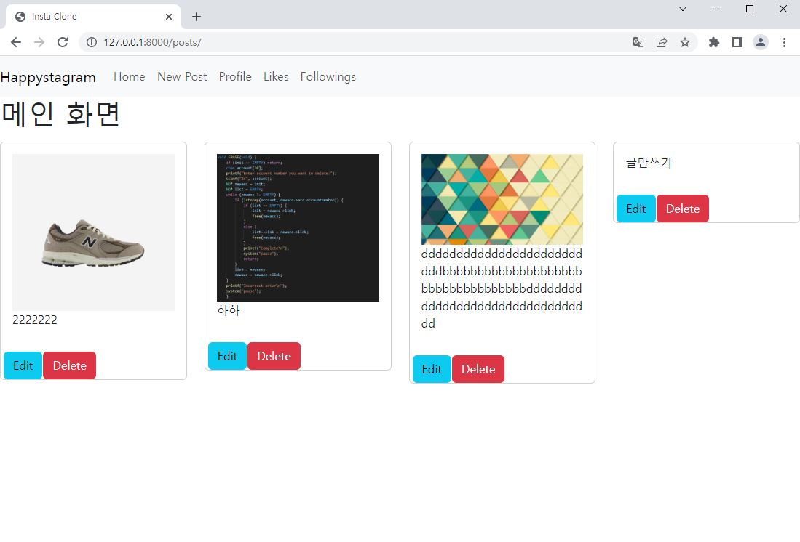

# 인스타그램 클론 코딩

- 목표
  
  - django 초기 환경 설정
  
  - CRUD 구현
  
  - 이미지 업로드 (media)
  
  - 로그인/로그아웃/회원가입
    
    - 회원탈퇴/정보수정/PW변경
  
  - bootstrap 활용 웹 디자인

### 0325

- 구현
  
  - django 초기 구성
  
  - CRUD
  
  - bootstrap navbar, content card

- 제약
  
  - html including 기능 구현하여 index.html 안에 post.html을 넣어 게시글 부분을 따로 받으려 했으나 일단은 index.html 안에서 context로 받아 출력하도록 구현함

- 미완성
  
  - navbar 반응성에서 햄버거 버튼 출력되는데 버튼 자체 기능 구현해야함
