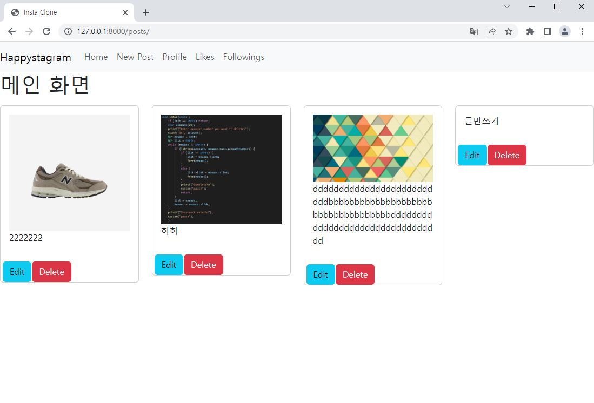
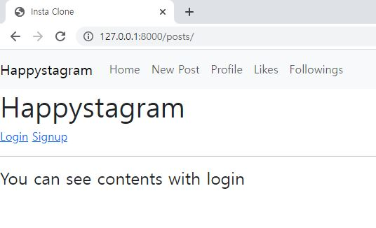
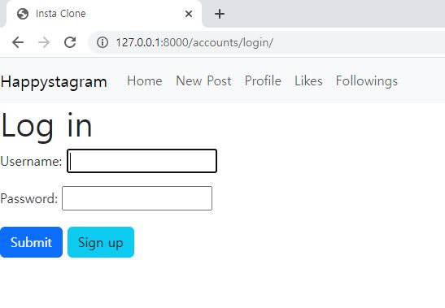
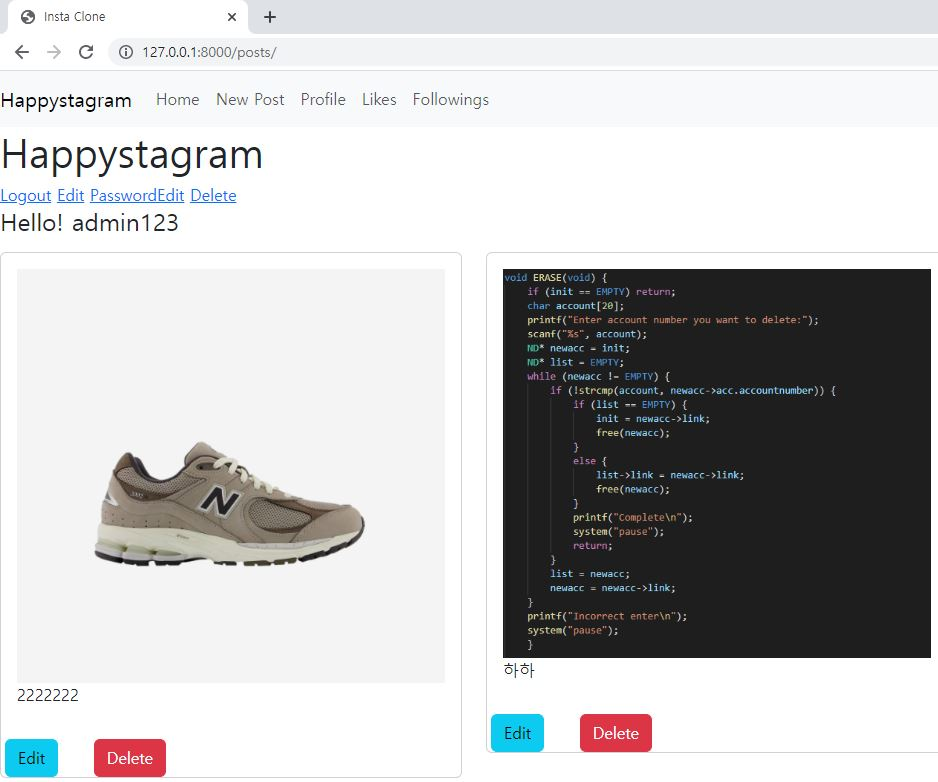
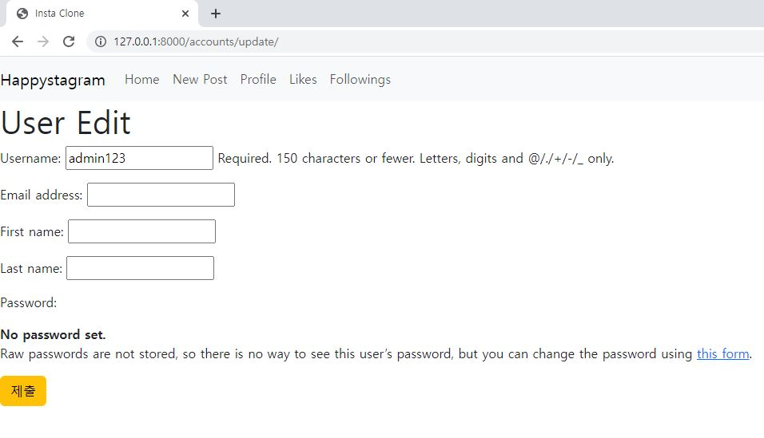
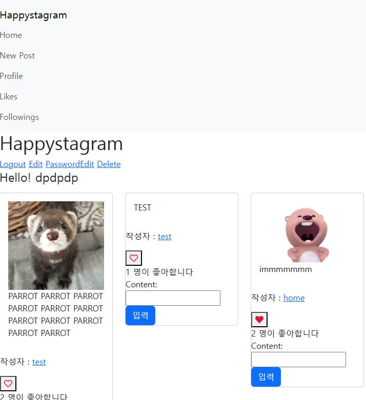
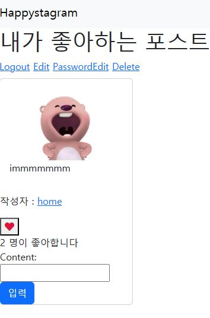
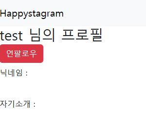
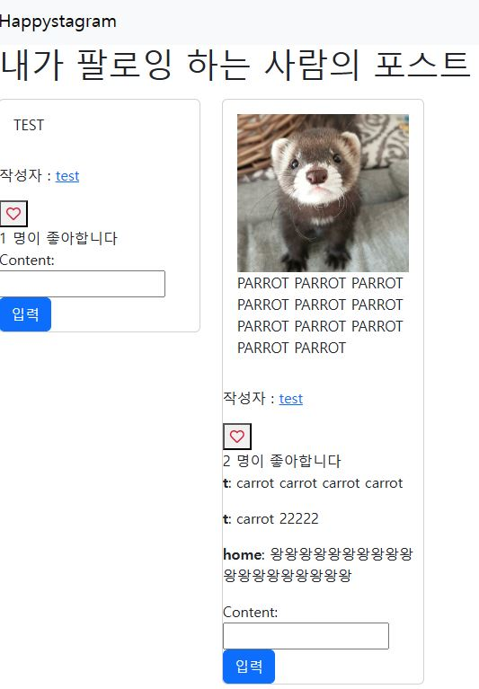

# 인스타그램 클론 코딩

- 목표
  
  - django 초기 환경 설정
  
  - CRUD 구현
  
  - 이미지 업로드 (media)
  
  - 로그인/로그아웃/회원가입
    
    - 회원탈퇴/정보수정/PW변경
  
  - bootstrap 활용 웹 디자인

---

### 0325

- 구현
  
  - django 초기 구성
  
  - CRUD
  
  - bootstrap navbar, content card

- 제약
  
  - html including 기능 구현하여 index.html 안에 post.html을 넣어 게시글 부분을 따로 받으려 했으나 일단은 index.html 안에서 context로 받아 출력하도록 구현함

- 미완성
  
  - navbar 반응성에서 햄버거 버튼 출력되는데 버튼 자체 기능 구현해야함

---

### 0326

- 구현
  
  - 유저 (로그인, 로그아웃, 회원가입, 정보수정, 비밀번호수정, 회원탈퇴)
    
    - django 이용

- 제약
  
  - forms.py에서 django form 그대로 이용해서 한글로 변환 안함

- 미완성
  
  - 햄버거 버튼
  
  - authenticated한 유저에 대한 content 업로드/삭제 권한

---

### 0416

- 구현
  
  - 댓글 생성/조회/삭제
  
  - 게시글 좋아요/좋아요한 게시글만 필터링
  
  - 유저 팔로우/팔로우한 유저 게시글만 필터링
  
  - 햄버거 버튼
  
  - 본인이 작성한 컨텐츠만 수정 및 삭제 가능하게 함

- 제약
  
  - 기능 구현만 신경 써서 요소들의 프론트 구성을 다루지 않아 지저분함

- 미구현
  
  - 프로필

---

- django의 기초적인 백엔드는 어느 정도 익혔다고 판단하여 프로젝트 종료

- DTL 이용하여 프론트엔드 작업하기 보다 다른 툴을 이용하는 것이 좋다고 생각됨 
